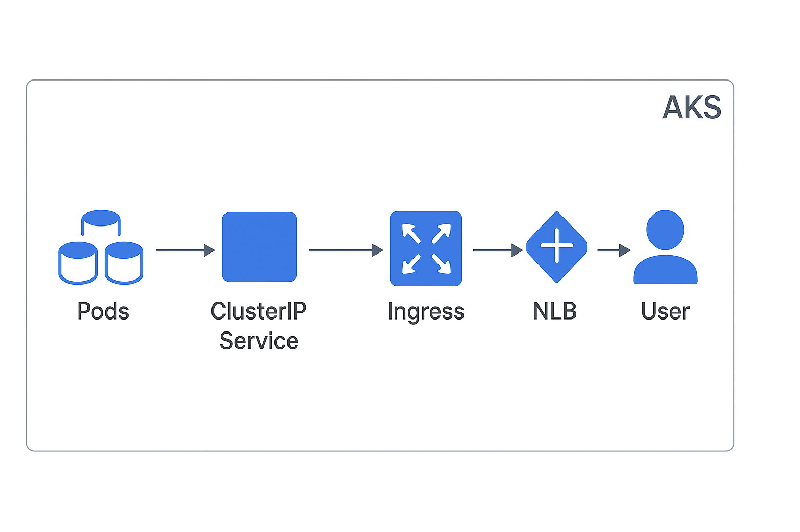

# Commands used for set-up

### Basic Flow inside Kubernetes

#### For webapp and service deployment 
``` kubectl apply -f webapp-deployment-service.yaml  ```

#### For installing NGINX Ingress Controller and Prometheus-Grafana
```
helm repo add prometheus-community https://prometheus-community.github.io/helm-charts
helm install monitoring prometheus-community/kube-prometheus-stack --namespace monitoring --create-namespace -f values-prom.yaml

helm repo add ingress-nginx https://kubernetes.github.io/ingress-nginx
helm upgrade --install ingress-nginx ingress-nginx/ingress-nginx -f values-ingress.yaml
```

#### For deploying ingress configurations for prometheus grafana and webapp application path based routing

``` kubectl apply -f ingress-monitoring.yaml ingress-webapp-service.yaml ```

#### For service discovery for prometheus to scrape metrics
 ``` kubectl apply -f prom-service-discovery.yaml ```
