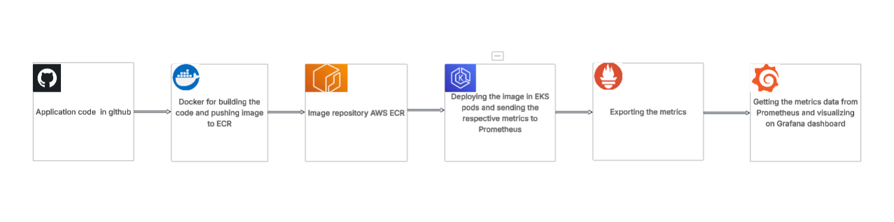

# Task 1 

## High-Level Flow Diagram
  
## Technologies Used
 1. Python - Development using Flask.
 2. AWS - Cloud infrastructure using EKS, ECR, and VPC.
 3. Terraform -  Infrastructure as Code (IaC) for deploying cloud resources.
 4. Docker - Containerization of the application
 5. Elastic Kubernetes Service (EKS) - Container orchestration and deployment.
 6. Prometehus and Grafana -  Monitoring, observability, and metrics visualization.

##  Highlights of Each Technology Used.

Python 
Developed a lightweight web application using Flask.
Implemented two endpoints: /gandalf and /colombo, each rendering custom HTML templates
Integrated Prometheus for metrics instrumentation and export.

Terraform 
Automated the provisioning of infrastructure components: VPC, EKS, and ECR.
Enabled quick and consistent creation/deletion of environments, saving time and cost.
Utilized official Terraform modules for EKS and VPC to simplify deployment.

Docker
Containerized the Flask web application using Docker.
Implemented a multi-stage build process to reduce image size.
Used a distroless Python image to minimize the attack surface and improve security.

Kubernetes
Deployed the application to a private AWS Elastic Kubernetes Service (EKS) cluster.
Used Deployment kind as for getting self-healing, scaling, and rollout management.
Configured an NGINX Ingress Controller with an external Load Balancer for path-based routing.
Set up Prometheus and Grafana within the cluster for monitoring and observability.

Prometheus and Grafana
Enabled Prometheus service discovery to automatically collect metrics from the application.
Created a custom Grafana dashboard to display request counts for each endpoint.

##  Task Access or Additional Notes

Webapp is available on - 
Graphana Dashboard is available on -
Each folder in the repository contains relevant commands and configurations used during setup and deployment.  